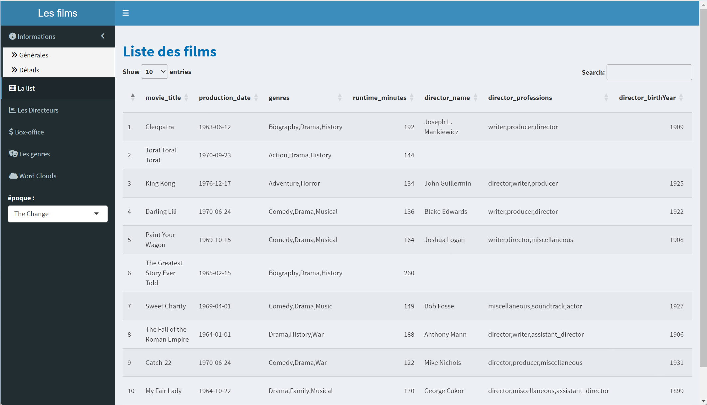
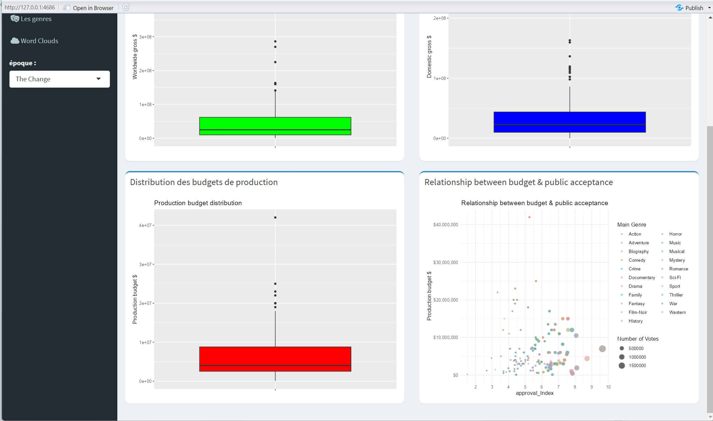
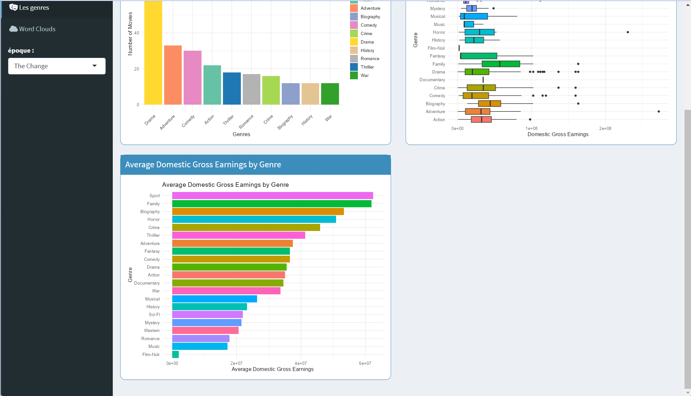

```{=html}
<style>
body {
text-align: justify}
</style>
```
```{r setup, include=FALSE, message=FALSE, warning=FALSE}
knitr::opts_chunk$set(
	echo = FALSE,
	message = FALSE,
	warning = FALSE
)
```

## **Introduction**

Dans le cadre de cette analyse de données, nous avons pour objectif
d'explorer divers aspects de l'industrie cinématographique afin de mieux
comprendre les facteurs influençant la performance financière des films
et les réactions du public. Cette étude se divise en cinq grandes
parties, chacune abordant un angle spécifique de l'analyse des données
cinématographiques.

-   Partie 1 : Facteurs affectant le box-office et leur corrélation.

-   Partie 2 : Focus sur l'impact du genre sur le succès d'un film.

-   Partie 3 : Focus sur l'influence du réalisateur sur le film.

-   Partie 4 : Analyse de films de différentes époques.

-   Partie 5 : Analyse des différents types de performances
    cinématographiques dans différents pays.

------------------------------------------------------------------------


## **PARTIE1 : Facteurs affectant le box-office et leur corrélation.**

### Objectifs de l'Analyse

L'objectif de cette analyse est de comprendre les tendances et les
facteurs clés influençant les performances financières des films, en
utilisant des données variées sur les budgets de production, les
recettes au box-office (nationales et mondiales), ainsi que les
évaluations et approbations des spectateurs. Cette étude vise à
identifier les relations entre ces variables pour offrir des
perspectives aux studios de cinéma sur la manière de maximiser leurs
profits tout en minimisant les pertes.

### QUESTION 1

> Définir les films qui ont fait des bénéfices et ceux qui ont perdu de
> l'argent

#### Visualisation：

```{r echo=FALSE, message=FALSE, warning=FALSE}

# Charger les packages nécessaires
library(ggplot2)
library(dplyr)

# Lire le jeu de données
movie_df <- read.csv("data/movie_statistic_dataset.csv")

# Créer une nouvelle colonne 'Earning', calculer le bénéfice ou la perte basé sur le budget de production et les recettes mondiales
movie_df <- movie_df %>%
  mutate(Earning = `Worldwide.gross..` - `Production.budget..`)

# Créer une nouvelle colonne 'EarningCategory', diviser les bénéfices ou pertes en différentes catégories
movie_df <- movie_df %>%
  mutate(EarningCategory = case_when(
    Earning < -100000000 ~ "< -100M",
    Earning >= -100000000 & Earning < -50000000 ~ "-100M to -50M",
    Earning >= -50000000 & Earning < -10000000 ~ "-50M to -10M",
    Earning >= -10000000 & Earning < 0 ~ "0 to -10M",
    Earning >= 0 & Earning < 10000000 ~ "0 to 10M",
    Earning >= 10000000 & Earning < 50000000 ~ "10M to 50M",
    Earning >= 50000000 & Earning < 100000000 ~ "50M to 100M",
    Earning >= 100000000 ~ "> 100M"
  ))

# Calculer le nombre de films par catégorie de bénéfice
earning_counts <- movie_df %>%
  count(EarningCategory) %>%
  mutate(EarningCategory = factor(EarningCategory, levels = c(
    "< -100M", "-100M to -50M", "-50M to -10M", "0 to -10M", 
    "0 to 10M", "10M to 50M", "50M to 100M", "> 100M"
  )))

# Diviser les données en deux parties : bénéfices et pertes
earning_counts <- earning_counts %>%
  mutate(EarningType = ifelse(grepl("-", EarningCategory), "Loss", "Profit"))

# Définir les couleurs, s'assurer que les pertes et les bénéfices utilisent des palettes de couleurs différentes
loss_colors <- c("darkred", "red", "orange", "yellow")
profit_colors <- c("lightgreen", "green", "darkgreen", "darkblue")

ggplot(earning_counts, aes(x = EarningCategory, y = ifelse(EarningType == "Loss", -n, n), fill = EarningCategory)) +
  geom_bar(stat = "identity") +
  geom_text(aes(label = abs(n)), vjust = ifelse(earning_counts$EarningType == "Loss", 1.5, -0.5), size = 3) +
  labs(title = "Répartition des films par intervalle de bénéfice/perte",
       x = "Intervalle de bénéfice/perte",
       y = "Nombre de films") +
  scale_fill_manual(values = c(loss_colors, profit_colors)) +
  theme_minimal() +
  theme(
    axis.text.x = element_text(angle = 45, hjust = 1, size = 8),  # Ajuster la taille du texte de l'axe x
    axis.text.y = element_text(size = 8),  # Ajuster la taille du texte de l'axe y
    plot.title = element_text(size = 14),  # Ajuster la taille du titre
    legend.text = element_text(size = 8)  # Ajuster la taille du texte de la légende
  )


```

#### Analyse graphique：

1.**Répartition du nombre de films** : L'intervalle avec le plus grand
nombre de films est "10M to 50M", avec un total de 1041
films.L'intervalle suivant est "0 to 10M", avec 960 films. Dans les
intervalles de bénéfices, "\> 100M" contient également un grand nombre
de films, avec 960 films.Dans les intervalles de pertes, l'intervalle
"-50M to -10M" a le plus grand nombre de films, avec 490 films.

2.**Nombre de films en perte** : Le nombre de films avec des pertes
importantes est relativement faible. Il n'y a qu'un seul film avec une
perte supérieure à 100M.Le nombre de films avec des pertes dans
l'intervalle "-100M to -50M" est de 33.Les intervalles "-50M to -10M" et
"0 to -10M" ont un nombre relativement élevé de films en perte, avec
respectivement 490 et 690 films.

3.**Nombre de films en bénéfice** : L'intervalle "0 to 10M" a le plus
grand nombre de films en bénéfice, avec 960 films.L'intervalle "10M to
50M" a le plus grand nombre de films en bénéfice, avec 1041 films.Les
intervalles "50M to 100M" et "\> 100M" ont également un nombre
relativement élevé de films, avec respectivement 533 et 632 films.

#### Conclusion：

En conclusion, le graphique montre que la majorité des films ont des
bénéfices ou des pertes dans une plage de fluctuation relativement
petite, avec peu de films réalisant des pertes ou des bénéfices très
importants. Les performances financières des films sont principalement
concentrées dans des intervalles de bénéfices modérés, en particulier
dans les intervalles de 0 à 10 millions et de 10 à 50 millions. Les
sociétés de production cinématographique doivent trouver un équilibre
entre les films à petit budget et les films à gros budget pour maximiser
les bénéfices et minimiser les pertes.

### QUESTION 2

> Analyser les distributions des recettes mondiales, des recettes
> domestiques et des budgets de production des films en utilisant un jeu
> de données spécifique.

#### Visualisation：

```{r echo=FALSE, fig.height=8, fig.width=12, message=FALSE, warning=FALSE}

library(ggplot2)
library(gridExtra)
library(scales)

df <- read.csv("data/movie_statistic_dataset.csv")

plot1 <- ggplot(df, aes(x = "", y = `Worldwide.gross..` / 1e9)) +
  geom_boxplot(fill = "green") +
  scale_y_continuous(labels = scales::dollar_format(prefix = "", suffix = "")) +
  labs(title = "Worldwide gross distribution", y = "Worldwide gross $ (Billion)") +
  theme(axis.title.x = element_blank())

plot2 <- ggplot(df, aes(x = "", y = `Domestic.gross..` / 1e9)) +
  geom_boxplot(fill = "blue") +
  scale_y_continuous(labels = scales::dollar_format(prefix = "", suffix = "")) +
  labs(title = "Domestic gross distribution", y = "Domestic gross $ (Billion)") +
  theme(axis.title.x = element_blank())

plot3 <- ggplot(df, aes(x = "", y = `Production.budget..` / 1e9)) +
  geom_boxplot(fill = "red") +
  scale_y_continuous(labels = scales::dollar_format(prefix = "", suffix = "")) +
  labs(title = "Production budget distribution", y = "Production budget $ (Billion)") +
  theme(axis.title.x = element_blank())

grid.arrange(plot1, plot2, plot3, nrow = 1)

```

#### Analyse graphique:

Le graphique présente trois boîtes à moustaches (boxplots) illustrant la
distribution des recettes mondiales, des recettes domestiques et des
budgets de production des films. Les trois distributions sont
représentées en milliards de dollars.

**Analyse globale**:

**Recettes mondiales (Worldwide gross)** :

La majorité des films génèrent des recettes mondiales inférieures à 1
milliard de dollars. Il y a quelques films exceptionnels qui génèrent
plus de 2 milliards de dollars, avec un film atteignant plus de 3
milliards de dollars.

**Recettes domestiques (Domestic gross)** :

Les recettes domestiques sont généralement inférieures à 0,5 milliard de
dollars pour la majorité des films. Comme pour les recettes mondiales,
il y a des films exceptionnels qui dépassent 0,75 milliard de dollars.

**Budgets de production (Production budget)** :

La plupart des films ont un budget de production inférieur à 0,1
milliard de dollars. Cependant, il y a quelques films avec des budgets
exceptionnellement élevés, atteignant jusqu'à 0,4 milliard de dollars.

**Analyse des points atypiques**:

**Recettes mondiales exceptionnelles** :

Les films qui génèrent plus de 2 milliards de dollars sont des anomalies
significatives dans les données. Ces films sont probablement des
blockbusters très populaires, souvent avec des franchises établies ou
des réalisateurs renommés.

Exemples de tels films pourraient inclure des titres comme "Avatar" et
"Avengers: Endgame", qui ont attiré un public mondial massif.

**Recettes domestiques élevées** :

Les films avec des recettes domestiques dépassant 0,5 milliard de
dollars sont également des cas atypiques. Ils bénéficient probablement
d'une forte popularité nationale et de stratégies de marketing
efficaces. Ces films peuvent aussi avoir des éléments culturels ou des
stars nationales qui attirent un large public domestique.

**Budgets de production élevés** :

Les films avec des budgets de production supérieurs à 0,2 milliard de
dollars sont souvent des films à gros budget avec des effets spéciaux
lourds, des castings de stars ou des franchises établies.

Les films avec des budgets exceptionnels peuvent inclure des productions
comme "Pirates des Caraïbes" ou "Star Wars", qui nécessitent des
investissements massifs pour la réalisation.

#### Conclusion:

**Distributions asymétriques** : Les trois distributions montrent une
forte asymétrie à droite, indiquant que la majorité des films se situent
dans une fourchette de recettes et de budgets relativement modestes,
avec quelques exceptions notables qui tirent les moyennes vers le haut.

**Points atypiques significatifs** : Les films avec des recettes et des
budgets exceptionnels sont rares mais ont un impact disproportionné sur
les données globales. Ces films sont souvent des blockbusters avec une
reconnaissance mondiale et des stratégies de marketing puissantes.

**Importance des franchises et des stars** : Les films qui se démarquent
par leurs recettes et leurs budgets élevés sont souvent associés à des
franchises établies, des réalisateurs renommés et des campagnes de
marketing globales, soulignant l'importance de ces facteurs dans le
succès financier des films.

En somme, bien que la majorité des films se situent dans une gamme de
budgets et de recettes modérés, les exceptions notables illustrent
l'impact significatif des blockbusters sur l'industrie
cinématographique.

### QUESTION 3

> Existe-t-il une corrélation entre les recettes nationales et
> internationales, la durée du film, le budget du film, la note moyenne
> du film, le nombre de personnes ayant voté pour le film et l'indice
> d'approbation ?

#### Visualisation：

```{r echo=FALSE, message=FALSE, warning=FALSE}
library(ggplot2)
library(dplyr)
library(corrplot)
movies <- read.csv("data/q1.csv")
selected_columns <- movies %>% 
  select(avgRating, Votes, approval_Index, budget, DomesticGross, 
         WorldwideGross, runtime)
cor_matrix <- cor(selected_columns)
knitr::opts_chunk$set(echo = TRUE)
corrplot(cor_matrix, method = "color", type = "upper", order = "hclust",
         cl.pos = "n",
         number.cex = 0.8,
         addCoef.col = "black")  
```

#### Analyse graphique：

Cette carte thermique montre la corrélation entre différentes variables
dans un ensemble de données cinématographiques. Les corrélations vont de
-1 (corrélation négative parfaite) à +1 (corrélation positive parfaite),
une valeur proche de 0 indiquant qu'il n'y a pas de corrélation
significative. Les couleurs plus foncées indiquent des corrélations plus
fortes, le bleu représentant une corrélation positive et le rouge (s'il
est présent) une corrélation négative. Le fait qu'aucune couleur rouge
n'apparaisse ici signifie que la corrélation entre toutes les variables
est positive.

1.  Budget & WorldwideGross ; Budget & DomesticGross : Les coefficients
    de corrélation sont respectivement de 0,73 et 0,66, ce qui montre
    une forte corrélation positive. Cela signifie que plus le budget
    d'un film est élevé, plus ses recettes mondiales et nationales
    tendent à l'être.

2.  DomesticGross & WorldwideGross : le coefficient de corrélation est
    de 0,94, ce qui indique une très forte corrélation positive entre
    les deux. Cela suggère que les films qui obtiennent habituellement
    de bons résultats au box-office national obtiendront également de
    bons résultats sur le marché mondial.

3.  La note du film (avgRating) et l'indice d'approbation
    (approval_Index) : le coefficient de corrélation est de 0,83, ce qui
    indique qu'il existe une forte corrélation positive entre les deux
    mesures, ce qui signifie que les films ayant une note élevée ont
    tendance à avoir également un indice d'approbation élevé.

4.  Les votes et l'indice d'approbation : le coefficient de corrélation
    est de 0,7, ce qui est une forte corrélation positive, indiquant que
    les films ayant plus de votes ont tendance à avoir un indice
    d'approbation plus élevé.

5.  La corrélation relativement faible entre la durée du film et les
    autres variables suggère que la durée du film n'est pas un facteur
    majeur affectant le box-office, les notes et l'indice d'approbation.

#### Conclusion：

La forte corrélation positive entre le budget de production d'un film et
les recettes du box-office mondial peut refléter le fait que les films à
plus gros budget disposent de plus de ressources pour attirer le public,
notamment grâce à des stars de renom, des effets spéciaux de haute
qualité et un marketing intensif. La corrélation très élevée entre le
box-office national et le box-office mondial peut signifier que les
films à succès ont tendance à être généralement bien accueillis au
niveau mondial, ou que les films ayant un box-office national élevé sont
plus susceptibles de bénéficier d'une distribution et d'une publicité
internationales. La note moyenne d'un film, le nombre de votes, est
fortement corrélée avec l'indice d'approbation, car l'indice
d'approbation est une valeur calculée à partir de la note moyenne du
film et du nombre de votes combinés.

### Résumé général

L'analyse révèle plusieurs tendances importantes dans l'industrie
cinématographique. Premièrement, les films à budget modéré, en
particulier ceux dont le budget se situe entre 10 et 50 millions de
dollars, sont les plus courants et tendent à avoir de bonnes
performances au box-office. Deuxièmement, bien que la plupart des films
se situent dans des plages de recettes et de budgets relativement
modestes, les blockbusters exceptionnels, avec des recettes mondiales
dépassant souvent 2 milliards de dollars, ont un impact disproportionné
sur les moyennes globales.

Les corrélations montrent que les films à gros budget sont plus
susceptibles de générer des recettes élevées, tant au niveau national
qu'international. En outre, les films qui réussissent bien sur le marché
domestique ont tendance à réussir également sur le marché mondial,
indiquant une forte synergie entre les performances nationales et
internationales. Enfin, les évaluations des spectateurs et l'indice
d'approbation, fortement corrélés, sont des indicateurs fiables de la
popularité et du succès commercial des films. Par contre, la durée d'un
film semble avoir un impact minimal sur ses performances financières et
critiques.

En conclusion, les studios de cinéma doivent stratégiquement équilibrer
leurs investissements entre les films à petit budget, qui constituent la
majorité, et les blockbusters, qui bien que rares, peuvent générer des
recettes massives et accroître la notoriété du studio.

------------------------------------------------------------------------

## **PARTIE2 : Focus sur l'impact du genre sur le succès d'un film.**

### Objectifs de l'Analyse

Cette analyse vise à comprendre les préférences du public et la
performance financière des différents genres cinématographiques. En
examinant la répartition des parts de marché, les revenus moyens, la
variabilité des performances et le retour sur investissement par genre,
elle fournit des insights précieux pour les cinéastes, les distributeurs
et les investisseurs.

#### Étapes du traitement des données pour les QUESTION1 et QUESTION2

1.  Regroupement par Genre : Regrouper les données par la colonne Genre.

2.  Calcul des agrégations : Pour chaque genre, calculer le nombre de
    films, la recette domestique moyenne et la recette mondiale moyenne.

### QUESTION 1

> Quel est le genre qui compte le plus grand nombre de films ?

#### Visualisation：

```{r echo=FALSE, message=FALSE, warning=FALSE}
library(ggplot2)
genre_counts <- read.csv("data/jzh.csv")
top_10_genres <- head(genre_counts, 10)
custom_colors <- c("#66c2a5", "#fc8d62", "#8da0cb", "#e78ac3", "#a6d854", "#ffd92f", "#e5c494", "#b3b3b3", "#1f78b4", "#33a02c")
ggplot(top_10_genres, aes(x = reorder(genre, -movie_count), y = movie_count, fill = genre)) +
  geom_bar(stat = "identity") +
  labs(title = "Top 10 Movie Genres", x = "Genre", y = "Movie Count") +
  theme_minimal() +
  scale_fill_manual(values = custom_colors) +
  geom_text(aes(label = movie_count), vjust = -0.3) +
  theme(legend.position = "none")
```

#### Analyse graphique:

1.  **Le drame** est le genre de film le plus représenté avec 2210
    films, occupant une position de premier plan.

2.  **La comédie** arrive en deuxième position avec 1656 films.

3.  **Les films d'action et d'aventure** sont respectivement en
    troisième et quatrième positions avec 1211 et 968 films.

4.  **Les films de crime et de romance** ont des chiffres proches, avec
    780 et 724 films respectivement.

5.  **D'autres genres comme le thriller, l'horreur, le mystère et la**
    **science-fiction** ont des nombres relativement plus faibles avec
    respectivement 668, 456, 409 et 379 films.

#### Conclusion :

Ces données montrent que les drames et les comédies sont les genres les
plus populaires, tandis que la science-fiction et le mystère sont moins
représentés. Cela peut refléter les préférences des spectateurs et les
tendances du marché.

### QUESTION 2

> Quels sont les types de films les plus performants au box-office ?

#### Visualisation:

#### Genres les plus rentables au niveau national et mondial:

```{r echo=FALSE, message=FALSE, warning=FALSE}
library(ggplot2)
library(scales)

file_path <- 'data/jzh.csv'
movies_df <- read.csv(file_path)
movies_df <- movies_df[movies_df$genre != "\\N", ]

ggplot(movies_df, aes(x = reorder(genre, Average_Worldwide_Gross), y = Average_Worldwide_Gross, fill = genre)) +
  geom_bar(stat = "identity") +
  coord_flip() +
  labs(title = "Average Worldwide Gross Earnings by Genre",
       x = "Genre",
       y = "Average Worldwide Gross Earnings") +
  theme_minimal() +
  theme(legend.position = "none") +
  scale_y_continuous(breaks = c(0, 1e8, 2e8, 3e8), labels = c("0", "1", "2", "3"),
                     sec.axis = sec_axis(~., name = "Earnings (in 100 millions)", labels = NULL))
```

#### Analyse graphique:

Ce graphique montre les recettes mondiales, que je comparerai aux
recettes nationales.

**Animation**: En tête des deux graphiques, indiquant une forte
performance tant au niveau national qu'international. **Adventure et
Sci-Fi**: Performances également cohérentes, se classant bien dans les
deux catégories de recettes. **Action et Fantasy**: Ces genres montrent
également de fortes recettes dans les deux mesures, bien qu'un peu
inférieures à l'Animation et à l'Aventure.

#### Disparités entre les recettes nationales et mondiales:

**Family and Comedy**: Ces genres sont relativement bien classés pour
les recettes nationales mais moins pour les recettes mondiales,
suggérant qu'ils pourraient résonner davantage avec le public national.

**Thriller**: Bien qu'important dans les recettes nationales, il occupe
une position plus basse dans les recettes mondiales.

**Musical and Mystery**: Ces genres montrent une baisse notable de
classement des recettes nationales aux recettes mondiales, ce qui
pourrait indiquer une plus forte attraction nationale.

**Genres avec des classements cohérents**:

**Crime, Drama, Horror, et Biography**: Ces genres maintiennent des
positions relativement cohérentes dans les recettes nationales et
mondiales, suggérant une attraction équilibrée.

**War et Romance**: Montrent une légère baisse dans les recettes
mondiales par rapport aux recettes nationales, mais restent néanmoins
classés en milieu de tableau.

**Genres à faibles revenus**:

**Genres like News, Documentary, Film-Noir, and Western**: Se classent
constamment bas dans les deux graphiques, indiquant un public de niche
avec un succès commercial limité.

#### Conclusions:

1.  **Animation, Adventure, et Sci-Fi** sont universellement populaires,
    montrant des recettes moyennes élevées tant au niveau national que
    mondial.

2.  **Family et Comedy** ont une plus grande attraction nationale,
    indiquant des préférences culturelles qui pourraient ne pas se
    traduire aussi bien à l'international.

3.  **Thriller, Musical, et Mystery** montrent une baisse notable
    d'attrait international, suggérant que ces genres pourraient être
    plus adaptés aux goûts nationaux.

4.  **Les performers constants comme Crime, Drama, et Horror** montrent
    une attraction équilibrée sur différents marchés, ce qui en fait des
    genres fiables pour l'investissement.

5.  **Les genres de niche comme Documentary, Film-Noir, et Western** ont
    un succès commercial limité, quel que soit le marché.

**La répartition du box-office mondial et nationale des films par
genre**

```{r echo=FALSE, message=FALSE, warning=FALSE}
library(ggplot2)
library(dplyr)
library(tidyr)

file_path <- 'data/movie_statistic_dataset.csv'
movies_df <- read.csv(file_path)
movies_df <- movies_df[movies_df$genre != "\\N", ]
plot_data <- movies_df %>% select(genres, Worldwide.gross..)
plot_data <- plot_data %>% separate_rows(genres, sep = ",")
colnames(plot_data) <- c("Genre", "Worldwide_gross")
plot_data$Worldwide_gross <- as.numeric(plot_data$Worldwide_gross)
plot_data <- plot_data %>% drop_na(Worldwide_gross)
ggplot(plot_data, aes(x = Genre, y = Worldwide_gross, fill = Genre)) +
  geom_boxplot() +
  coord_flip() +
  labs(title = "Distribution of Worldwide Gross Earnings by Genre",
       x = "Genre",
       y = "Worldwide Gross Earnings") +
  theme_minimal() +
  theme(legend.position = "none") +
  scale_y_continuous(breaks = c(0, 1e9, 2e9, 3e9), labels = c("0", "1", "2", "3"),
                     sec.axis = sec_axis(~ ., name = "Earnings (in billions)", labels = NULL))

```

#### Analyse graphique:

Ce graphique montre la répartition du box-office mondial des films par
genre. Il est à comparer avec la répartition des recettes nationales
totales :

**Animation et aventure en tête** : Les genres animation (Animation) et
aventure (Adventure) ont les revenus moyens les plus élevés, montrant
leur popularité et rentabilité. Genres à hauts revenus : Les genres
science-fiction (Sci-Fi), action (Action) et fantasy (Fantasy) sont
également performants, indiquant une préférence pour les films
visuellement spectaculaires et imaginatifs.

**Genres à revenus faibles** : Les genres documentaire (Documentary),
film noir (Film-Noir), journalisme (News) et western (Western) ont les
revenus les plus bas, probablement en raison d'un public plus restreint
et d'une attraction commerciale moindre.

**Variabilité des revenus** : La haute variabilité dans les genres
aventure (Adventure), animation (Animation) et action (Action) montre
que, bien que ces genres puissent produire des blockbusters, tous les
films ne réussissent pas.

**Blockbusters** : Les valeurs aberrantes significatives dans les genres
aventure (Adventure) et animation (Animation) indiquent que ces
catégories peuvent produire des films à revenus exceptionnellement
élevés.

#### Conclusions :

Les genres **d'animation et d'aventure** dominent en termes de revenus
moyens, soulignant leur popularité et leur rentabilité. Les genres à
hauts revenus comme **la science-fiction, l'action et la fantasy**
bénéficient également d'une forte attractivité grâce à leurs éléments
visuels spectaculaires. En revanche, les genres tels que **le
documentaire, le film noir,** **le journalisme et le western** attirent
un public plus restreint, se traduisant par des revenus plus faibles.
Les genres **d'animation,** **d'aventure et d'action** sont les plus
susceptibles de produire des blockbusters, bien que tous les films dans
ces catégories ne réussissent pas de manière égale.

### QUESTION 3

> Quelle est la relation entre le nombre de films de différents genres,
> leur budget de production moyen et leurs recettes au box-office ?

#### Visualisation：

```{r echo=FALSE, fig.height=10, fig.width=18, message=FALSE, warning=FALSE}
# Charger les packages nécessaires
library(ggplot2)
library(tidyr)
library(dplyr)

# Lire le jeu de données
movie_df <- read.csv("data/movie_statistic_dataset.csv")

movie_df <- movie_df %>%
  separate_rows(genres, sep = ",") %>%
  mutate(genres = trimws(genres)) %>%
  filter(genres != "" & genres != "\\N")

if ("\\N" %in% unique(movie_df$genres)) {
  stop("Les données filtrées contiennent encore la catégorie \\N, veuillez vérifier les étapes de traitement des données.")
}

count_first_genre_gb <- movie_df %>%
  group_by(genres) %>%
  summarize(
    Frequency = n(),
    `Worldwide gross $` = mean(`Worldwide.gross..`, na.rm = TRUE),
    `Production budget $` = mean(`Production.budget..`, na.rm = TRUE)
  ) %>%
  arrange(desc(Frequency))

# Transformer les données en format long pour ggplot
count_first_genre_long <- count_first_genre_gb %>%
  gather(key = "Metric", value = "Value", -genres, -Frequency)

# Utiliser ggplot2 pour créer le graphique
ggplot(data = count_first_genre_gb, aes(x = reorder(genres, -Frequency))) +
  geom_bar(aes(y = Frequency), stat = "identity", fill = "steelblue") +
  geom_line(data = count_first_genre_long %>% filter(Metric == "Worldwide gross $"),
            aes(y = Value / 1e6, color = "Recette mondiale moyenne", group = 1), size = 1) +
  geom_line(data = count_first_genre_long %>% filter(Metric == "Production budget $"),
            aes(y = Value / 1e6, color = "Budget de production moyen", group = 1), size = 1) +
  scale_y_continuous(
    name = "Nombre de films",
    sec.axis = sec_axis(~ . * 1e6, name = "Dollars ($)", labels = scales::dollar)
  ) +
  scale_color_manual(name = "Métriques",
                     values = c("Recette mondiale moyenne" = "green", "Budget de production moyen" = "red")) +
  theme(axis.text.x = element_text(angle = 45, size = 8, hjust = 1)) +  # Faire pivoter les étiquettes de l'axe x de 45 degrés
  labs(title = "Recettes et budget des différents genres de films", x = "Genre") +
  theme_minimal()

```

#### Analyse graphique：

Comme le montre le graphique, les catégories Drame, Comédie et Action
sont celles qui comptent le plus grand nombre de films produits, avec
respectivement plus de 2 000, 1 500 et 1 000 films. D'autres catégories
comptent relativement moins de films, notamment les catégories
Documentaire, Comédie musicale, Western et Film noir, qui comptent moins
de 50 films. Au box-office mondial, les films des catégories Aventure et
Animation sont les plus performants, l'Aventure ayant le box-office
mondial le plus élevé de toutes les catégories, avec près de 3 milliards
de dollars. Les budgets de production sont également relativement élevés
dans les catégories Aventure et Animation, ce qui correspond à leurs
recettes mondiales. D'autres catégories, telles que la science-fiction
et le fantastique, ont également des budgets de production élevés, mais
légèrement inférieurs à ceux de l'aventure et de l'animation.

#### Conclusion：

Les performances commerciales des catégories de films ne sont pas
nécessairement proportionnelles au nombre de productions. Si les
catégories Drame, Comédie et Action sont celles qui comptent le plus
grand nombre de productions, elles ne sont pas aussi performantes au
box-office mondial et en termes de budgets de production que certaines
des catégories plus petites telles que l'Aventure et l'Animation. Les
catégories de films à fortes recettes telles que l'aventure et
l'animation s'accompagnent généralement de budgets de production plus
élevés, ce qui suggère qu'un investissement important peut conduire à
des rendements élevés. Il peut être judicieux pour les studios
d'explorer et d'investir dans des catégories plus petites mais très
performantes, telles que les films d'aventure et d'animation, qui ont le
potentiel de surpasser le box-office mondial !

### QUESTION 4

> Quelle est la relation entre la rentabilité des films dans différentes
> catégories et leurs notes moyennes ?

#### Visualisation：

```{r echo=FALSE, fig.height=4, fig.width=16, message=FALSE, warning=FALSE}
# Charger les packages nécessaires
library(ggplot2)
library(dplyr)
library(tidyr)

# Lire le jeu de données
movie_df <- read.csv("data/movie_statistic_dataset.csv")

# Créer une nouvelle colonne 'Earning', calculer le bénéfice ou la perte basé sur le budget de production et les recettes mondiales
movie_df <- movie_df %>%
  mutate(Earning = ifelse(`Worldwide.gross..` > `Production.budget..`, "Profit", "Loss"))

# Créer un nouveau dataframe contenant le nombre de films, la note moyenne et l'état de profit/perte
df4 <- movie_df %>%
  separate_rows(genres, sep = ",") %>%
  mutate(genres = trimws(genres)) %>%
  filter(genres != "" & genres != "\\N") %>%
  group_by(genres, Earning) %>%
  summarize(
    movie_title = n(),
    movie_averageRating = mean(movie_averageRating, na.rm = TRUE),
    .groups = "drop"
  ) %>%
  arrange(desc(movie_title))

# Créer un facteur de mise à l'échelle
scale_factor <- 100

# Tracer le graphique des barres de profit/perte et la ligne de la note moyenne
ggplot(data = df4, aes(x = reorder(genres, -movie_title), y = movie_title, fill = Earning)) +
  geom_bar(stat = "identity", position = position_dodge()) +
  geom_text(aes(label = movie_title), vjust = -0.3, position = position_dodge(width = 0.9)) +
  scale_y_continuous(
    name = "Nombre de films"
  ) +
  geom_ribbon(data = df4 %>% filter(Earning == "Profit"), aes(x = genres, ymin = 0, ymax = movie_averageRating * scale_factor), fill = "red", alpha = 0.1) +
  labs(title = "Profit/Perte par Genre", x = "Genre", fill = "Earning") +
  theme(axis.text.x = element_text(angle = 90, vjust = 0.5, hjust = 1)) +
  theme_minimal()
```

#### Analyse graphique：

1.**Distribution des Films par Genre** :

Drame : Le genre drame a le plus grand nombre de films avec 1491 films
en profit et 719 films en perte, ce qui en fait le genre le plus
représenté dans les deux catégories.

Comédie : La comédie suit avec 1214 films en profit et 442 films en
perte, indiquant une forte présence dans le marché du film.

Action : Le genre action a 910 films en profit et 301 films en perte,
montrant également une prédominance significative.

Aventure et Crime : Ces genres ont respectivement 767 films en profit et
201 films en perte pour l’aventure, et 526 films en profit et 254 films
en perte pour le crime.

Romance, Thriller, et Horreur : La romance (524 en profit, 151 en
perte), le thriller (517 en profit, 90 en perte) et l’horreur (366 en
profit, 107 en perte) montrent une distribution similaire, avec plus de
films en profit que de films en perte.

2.**Genres avec Moins de Représentation** :

Fantastique, Biographie, Famille : Le fantastique (293 en profit, 81 en
perte), la biographie (269 en profit, 113 en perte) et les films
familiaux (225 en profit, 66 en perte) ont moins de films comparés aux
genres principaux mais montrent toujours une majorité de films en
profit.

Animation et Histoire : Les films d'animation (199 en profit, 31 en
perte) et les films historiques (210 en profit, 81 en perte) affichent
également plus de films en profit.

Musique, Sport, Guerre : Les genres musique (97 en profit, 48 en perte),
sport (44 en profit, 70 en perte) et guerre (31 en profit, 55 en perte)
ont une représentation plus faible et des ratios de profit/perte plus
variés.

Documentaire, Musical, Western : Les documentaires (20 en profit, 47 en
perte), les films musicaux (19 en profit, 37 en perte) et les westerns
(19 en profit, 25 en perte) sont moins représentés et ont plus de films
en perte que de films en profit.

Film noir et Actualités : Le film noir (7 en profit, 1 en perte) et les
films d’actualités (1 en profit, 0 en perte) ont le moins de films
représentés.

#### Conclusion：

En conclusion, cette analyse révèle que les genres principaux comme le
drame, la comédie et l'action dominent l'industrie du film en termes de
nombre total de films, avec une majorité de films réalisant des profits.
La plupart des genres montrent un nombre de films en profit supérieur à
celui des films en perte, indiquant une tendance générale à la
rentabilité. Cependant, certains genres moins représentés, comme les
documentaires, les films musicaux et les westerns, présentent un risque
plus élevé de pertes. Les genres comme la biographie, l’animation et
l’histoire, bien que moins représentés, montrent un potentiel de profit
significatif et pourraient bénéficier de plus d'investissements et de
marketing.

### QUESTION 5

> Analyser la relation entre le budget de production des films et leur
> acceptation par le public, tout en prenant en compte les genres
> principaux et le nombre de votes.

#### Visualisation:

Utiliser ggplot2 pour créer un diagramme de dispersion représentant la
relation entre le budget de production et l'indice d'approbation. Les
points sont colorés par genre et la taille des points reflète le nombre
de votes.

```{r echo=FALSE, fig.height=6, fig.width=10, message=FALSE, warning=FALSE}
# Load necessary libraries
library(ggplot2)
library(dplyr)
library(tidyr)
library(colorspace)

# Load the dataset
data <- read.csv('data/movie_statistic_dataset.csv')
data <- data[data$genre != "\\N", ]

# Separate the genres into individual rows
data <- data %>%
  separate_rows(genres, sep = ",")

# Define a custom color palette using colorspace to cover a wide range of colors
unique_genres <- unique(data$genres)
palette <- rainbow_hcl(length(unique_genres), start = 0, end = 360)
color_mapping <- setNames(palette, unique_genres)

# Generate the scatter plot
ggplot(data, aes(x = approval_Index, y = Production.budget.., color = genres, size = movie_numerOfVotes)) +
  geom_point(alpha = 0.6, shape = 16) +  # Change the marker to filled circle
  scale_color_manual(values = color_mapping) +
  scale_x_continuous(
    breaks = 0:10, 
    labels = 0:10
  ) +
  scale_y_continuous(labels = scales::dollar) +
  labs(
    title = "Relationship between budget & public acceptance",
    x = "approval_Index",
    y = "Production budget $",
    color = "Main Genre",
    size = "Number of Votes"
  ) +
  theme_minimal() +
  theme(
    plot.title = element_text(hjust = 0.5),
    legend.position = "right"
  )

```

#### Analyse graphique:

Le graphique présente la relation entre le budget de production des
films (en dollars) et leur indice d'approbation (approval_Index). Les
points sur le graphique représentent différents films, colorés en
fonction de leur genre principal et la taille des points indique le
nombre de votes reçus.

**Analyse globale**:

**Tendance générale**:

La majorité des films avec un budget de production élevé (plus de 100
millions de dollars) ont un indice d'approbation relativement élevé,
généralement supérieur à 5.

La plupart des films avec un budget de production faible (moins de 50
millions de dollars) ont une grande variation dans l'indice
d'approbation, allant de 1 à 10.

**Concentration des points** :

Il y a une concentration notable de films avec un budget de production
entre 0 et 50 millions de dollars et un indice d'approbation entre 3 et
6. Cela indique que de nombreux films à budget modeste obtiennent des
niveaux d'approbation moyens.

Les films avec des budgets extrêmement élevés (plus de 200 millions de
dollars) sont rares mais tendent à avoir des indices d'approbation
variés.

**Analyse des points atypiques**:

**Films à haut budget et faible approbation**:

Certains films, malgré un budget de production très élevé (plus de 100
millions de dollars), ont un indice d'approbation inférieur à 5. Ces
films peuvent avoir plusieurs raisons pour

**expliquer ce phénomène**:

Mauvais scénario ou réalisation, malgré des effets spéciaux et une
production coûteuse.

Mauvaise réception critique ou public insatisfait.

Problèmes de distribution ou de marketing.

**Films à faible budget et forte approbation**:

D'autres films avec un budget de production faible (moins de 50 millions
de dollars) obtiennent des indices d'approbation très élevés (supérieurs
à 7).

**Ces succès peuvent être attribués à** :

Un scénario solide et une excellente réalisation.

Un bouche-à-oreille positif et une réception critique favorable.

Innovation ou originalité dans la présentation et le contenu.

#### Conclusion:

La relation entre le budget de production et l'acceptation du public
montre une grande variabilité, influencée par le genre du film et le
nombre de votes. Les films avec un budget élevé tendent à avoir une
meilleure acceptation, mais il existe de nombreuses exceptions,
indiquant que d'autres facteurs jouent un rôle important dans la
popularité d'un film.

### QUESTION 6

> Quelles sont les catégories de films dont le retour sur investissement
> (ROI) moyen est le plus élevé ?

**La phase de préparation des données:**

1.  **Conversion des données** : veillez à ce que tous les champs
    numériques, tels que le budget et les recettes des guichets, soient
    convertis en types numériques pour faciliter les calculs
    mathématiques.

2.  **Décomposition des données**:

    **Chaîne divisée** : nous avons décomposé les multiples catégories
    du champ « type de film » en lignes séparées par « , », chaque ligne
    contenant un film et un genre, ce qui facilite l'analyse d'un seul
    genre.

    **Création d'une nouvelle variable** : nous avons créé une nouvelle
    variable, le retour sur investissement (ROI) :
    $\text{ROI} = \left( \frac{\text{Worldwide\_gross} - \text{Production\_budget}} {\text{Production\_budget}} \right) \times 100$

3.  **Agrégation des données:**

    **Agrégation par catégorie:** nous avons agrégé les données par
    genre de film et calculé le retour sur investissement moyen pour
    chaque catégorie.

    **Tri:** les résultats ont été triés par retour sur investissement,
    montrant clairement les genres de films ayant le retour sur
    investissement le plus élevé, ce qui permet d'identifier rapidement
    les catégories les plus performantes.

#### Visualisation :

```{r echo=FALSE, message=FALSE, warning=FALSE}
library(ggplot2)

data <- read.csv("data/ex2.csv")

ggplot(data, aes(x=reorder(genre, -ROI), y=ROI, fill=genre)) +
  geom_bar(stat="identity", color="black") +
  theme_minimal() +
  labs(title="Average ROI by Movie Genre",
       x="Genre",
       y="Return on Investment (ROI)",
       fill="Genre") +
  theme(axis.text.x=element_text(angle=45, hjust=1)) 

```

#### Analyse graphique:

Cet histogramme montre le retour sur investissement (ROI) moyen pour
différents genres de films.

**Genres à ROI élevé :** Les actualités ont le retour sur investissement
moyen le plus élevé de tous les genres, bien plus élevé que les autres
genres. Cela pourrait indiquer que les films d'actualité sont moins
chers à produire ou qu'ils ont un public restreint mais régulier. Les
documentaires ont également un retour sur investissement relativement
élevé, ce qui suggère que, comme pour les actualités, ces genres ont des
coûts de production moins élevés ou une base d'audience fidèle qui
assure leur rentabilité.

**Les genres à ROI moyen à élevé :** Les films de guerre, de suspense,
les films noirs et les films d'horreur ont un retour sur investissement
plus élevé. Ces genres peuvent également être en mesure de bien
contrôler les coûts ou d'attirer fortement leur public cible, ce qui les
rend relativement performants en termes de retour sur investissement.

**Les genres à ROI moyen :** Les genres tels que l'animation, la
science-fiction, le thriller, la musique, le sport et la fantaisie
affichent un retour sur investissement moyen, ce qui suggère que ces
genres peuvent nécessiter un investissement plus important, mais qu'ils
peuvent néanmoins obtenir de bons résultats sur le marché.

**Les genres à faible ROI :** Les genres populaires tels que le drame,
la comédie, la romance et l'action ont un faible retour sur
investissement. Il s'agit de genres populaires, mais le faible retour
sur investissement peut être dû à des coûts de production plus élevés et
à une concurrence intense sur le marché. Les biographies et l'histoire
affichent également un faible retour sur investissement, ce qui peut
refléter les coûts plus élevés ou les publics plus restreints qui
peuvent être impliqués dans la représentation précise d'événements
historiques ou biographiques.

#### Conclusion :

**Coût par rapport à la taille du public :** les genres ayant le
meilleur retour sur investissement tendent à être ceux qui peuvent être
produits à moindre coût ou ciblés sur des segments de public spécifiques
qui garantissent une audience ou des ventes suffisantes par rapport à
leur budget.

**Les genres populaires et le retour sur investissement :** les genres
plus courants tels que l'action, la comédie et le drame ont généralement
un retour sur investissement plus faible, peut-être en raison des coûts
de production élevés et de la nécessité d'attirer un large public, ce
qui peut s'avérer plus risqué en termes de rentabilité.

**Tendances du marché :** la popularité et la rentabilité des actualités
et des documentaires peuvent refléter l'évolution actuelle du marché
vers des divertissements plus basés sur les faits et la vie réelle, qui
peut être influencée par les plateformes numériques et l'évolution des
préférences du public.

Cette analyse des ROI par genre cinématographique offre aux
investisseurs et producteurs de l'industrie cinématographique des
insights précieux, leur permettant de prendre des décisions
d'investissement plus éclairées, d'optimiser la répartition des budgets
et de développer des stratégies de marketing plus efficaces. En
comprenant quels genres de films peuvent générer un retour sur
investissement plus élevé et ceux qui pourraient nécessiter des
stratégies innovantes pour améliorer leur performance sur le marché, les
professionnels du secteur peuvent mieux s'adapter aux dynamiques du
marché et augmenter le potentiel de succès commercial de leurs projets.

### Résumé général

Les genres les plus produits, tels que le drame, la comédie et l'action,
montrent des performances de marché relativement bonnes, mais comportent
aussi des risques importants, notamment le drame, souvent déficitaire.
Les genres aventure et animation, bien que moins produits, se révèlent
très rentables avec des revenus exceptionnels, suggérant que des
investissements élevés peuvent conduire à des rendements élevés.
Cependant, les genres à faibles revenus, comme le documentaire et le
film noir, attirent un public plus restreint et présentent une
rentabilité commerciale moindre.

La popularité et la rentabilité varient significativement selon les
genres. Les genres d'action, d'aventure et de science-fiction sont
performants grâce à leur attrait visuel et leur capacité à produire des
blockbusters. En revanche, les genres comme l'horreur et le mystère,
bien que populaires, montrent une variabilité élevée dans leur
performance financière, nécessitant une analyse de marché approfondie
pour minimiser les risques.

En conclusion, pour maximiser le retour sur investissement, il est
judicieux d'explorer et d'investir dans des genres performants tels que
l'aventure et l'animation. Les genres courants, bien que populaires,
peuvent présenter des risques en termes de rentabilité, et nécessitent
des stratégies innovantes pour améliorer leur performance sur le marché.
Les tendances actuelles montrent également une préférence pour des
contenus plus réalistes et basés sur les faits, influencées par les
plateformes numériques et l'évolution des préférences du public.

------------------------------------------------------------------------

## **PARTIE3 : Focus sur l'influence du réalisateur sur le film.**

### Objectifs de l'Analyse

L'analyse des réalisateurs vise à évaluer la performance des cinéastes à
travers trois paramètres clés : la note moyenne des films, les recettes
moyennes et les budgets totaux de production. L'objectif est de
distinguer les réalisateurs dont les films sont les mieux notés, ceux
qui génèrent les recettes brutes les plus élevées, et ceux qui ont les
budgets de production les plus importants. Cette évaluation nous permet
de comprendre les différents styles et priorités des réalisateurs,
qu'ils soient axés sur la qualité artistique ou sur le succès
commercial.

### QUESTION 1

> Quels sont les réalisateurs les plus populaires auprès du public et
> les plus performants au box-office ?

#### Visualisation:

#### Les 10 premiers réalisateurs par note moyenne:

```{r echo=FALSE, message=FALSE, warning=FALSE}
library(ggplot2)
data <- read.csv("data/movie_statistic_dataset.csv")
data <- data[data$director_name != "-", ]
average_rating <- aggregate(movie_averageRating ~ director_name, data, mean)
top_10_directors <- head(average_rating[order
                                        (-average_rating$movie_averageRating), 
                                        ], 10)

ggplot(top_10_directors, aes(x = reorder(director_name, movie_averageRating), 
                             y = movie_averageRating, fill = director_name)) +
  geom_bar(stat = "identity") +
  coord_flip() +
  labs(title = "Top 10 Directors by Average Rating", x = "Director", 
       y = "Average Rating") +
  theme_minimal() +
  theme(legend.position = "none")

```

#### Analyse graphique:

Steve Kopera, Tim Martin Crouse et Michael P. Nash sont les trois
premiers réalisateurs par note moyenne, tous avec des notes proches de
8. Tous les réalisateurs du top 10 ont une note moyenne de 7 ou plus, ce
qui indique que les films produits par ces réalisateurs sont
généralement bien accueillis par le public.

#### Top 10 des réalisateurs par revenus moyen:

```{r echo=FALSE, message=FALSE, warning=FALSE}
library(ggplot2)

data <- read.csv("data/movie_statistic_dataset.csv")
data <- data[data$director_name != "-", ]
average_earnings <- aggregate(Production.budget.. ~ director_name, data, mean)
top_10_directors <- head(average_earnings[
  order(-average_earnings$Production.budget..), ], 10)

ggplot(top_10_directors, aes(x = reorder(director_name, Production.budget..), 
                             y = Production.budget.., fill = director_name)) +
  geom_bar(stat = "identity") +
  coord_flip() +
  labs(title = "Top 10 Directors by Average Earnings", x = "Director", 
       y = "Average Earnings") +
  theme_minimal() +
  theme(legend.position = "none") + 
    scale_y_continuous(breaks = c(0, 1e8, 2e8), labels = c("0", "1", "2"),
                     sec.axis = sec_axis(~., name = "Earnings (in 100 millions)", labels = NULL))
```

#### Analyse graphique:

Andrew Stanton est le premier réalisateur en termes de revenus moyens,
avec une moyenne bien plus élevée que celle de tous les autres
réalisateurs. Joss Whedon, Lee Unkrich et Josh Cooley ont également des
moyennes élevées, chacun ayant gagné plus de 150 millions de dollars.
Les recettes moyennes des 10 premiers réalisateurs sont toutes
supérieures à 100 millions de dollars, ce qui indique que les films de
ces réalisateurs se vendent très bien au box-office.

#### Conclusions :

**La différence entre les réalisateurs les mieux notés et les
réalisateurs** **qui gagnent le plus** :

Réalisateurs bien notés : des réalisateurs comme Steve Kopera, Tim
Martin Crouse et Michael P. Nash ont des films bien notés, mais cela ne
signifie pas nécessairement que leurs films ont les recettes les plus
élevées. Réalisateurs à fortes recettes : des réalisateurs comme Andrew
Stanton, Joss Whedon et Lee Unkrich ont réalisé des recettes plus
importantes, mais cela ne signifie pas nécessairement que leurs films
sont les mieux notés.

**Facteurs influençant le succès d'un film** : Équilibre entre
l'audience et les recettes : certains réalisateurs parviennent à trouver
un équilibre entre une audience élevée et des recettes importantes,
comme Joss Whedon et Lee Unkrich, qui non seulement obtiennent de bons
résultats au box-office, mais ont également une audience relativement
élevée pour leurs films. Domaines d'intérêt : certains réalisateurs se
concentrent davantage sur la réalisation de films de grande qualité,
acclamés par la critique, tandis que d'autres s'intéressent davantage au
succès commercial et aux recettes au guichet.

### QUESTION 2

> Analyser les 10 réalisateurs ayant le plus dépensé en termes de budget
> de production de films.

#### Visualisation:

Utiliser ggplot2 pour créer un diagramme en barres horizontal
représentant les 10 réalisateurs ayant le plus dépensé, avec une échelle
de couleurs pour indiquer le montant total du budget.

```{r pressure, echo=FALSE, message=FALSE, warning=FALSE}

# Load necessary libraries
library(ggplot2)
library(dplyr)
library(colorspace)
library(scales)

# Load the dataset
data <- read.csv('data/movie_statistic_dataset.csv')

# Summarize the data to get total budgets per director
director_budgets <- data %>%
  group_by(director_name) %>%
  summarise(total_budget = sum(Production.budget.., na.rm = TRUE)) %>%
  arrange(desc(total_budget)) %>%
  head(11)  # Get top 11 to later remove the top 1

# Remove the highest spender director
director_budgets <- director_budgets[-1,]

# Generate a custom color palette using colorspace
palette <- rainbow_hcl(nrow(director_budgets), start = 0, end = 360)

# Generate the bar plot
ggplot(director_budgets, aes(x = reorder(director_name, total_budget), y = total_budget, fill = director_name)) +
  geom_bar(stat = "identity") +
  coord_flip() +
  scale_fill_manual(values = palette) +
  scale_y_continuous(labels = label_number(scale = 1, big.mark = ",")) +
  labs(
    title = "Top 10 spenders directors",
    x = "Director Name",
    y = "Directors budget"
  ) +
  theme_minimal() +
  theme(
    plot.title = element_text(hjust = 0.5),
    legend.position = "none"  # Remove legend for cleaner look
  ) + 
    scale_y_continuous(breaks = c(0, 5e8, 10e8, 15e8), labels = c("0", "5", "10","15"),
                     sec.axis = sec_axis(~., name = "Budget (in 100 millions)", labels = NULL))

```

#### Analyse graphique:

Le graphique montre les dix réalisateurs ayant les budgets de production
les plus élevés. Les noms des réalisateurs sont listés sur l'axe
vertical, tandis que leurs budgets de production totaux sont représentés
sur l'axe horizontal. Les couleurs différentes sont utilisées pour
chaque réalisateur afin de les distinguer visuellement.

**Analyse globale**:

**Répartition des budgets** :

Steven Spielberg se distingue nettement avec un budget de production
total considérablement plus élevé que les autres réalisateurs.

Les autres réalisateurs, bien que possédant des budgets élevés, sont
relativement proches les uns des autres en termes de dépenses totales.

**Variation des budgets** :

Les budgets des réalisateurs varient entre environ 1,2 milliard de
dollars pour Steven Spielberg et environ 500 millions de dollars pour
David Yates, le dixième réalisateur sur la liste.

Les écarts entre les budgets des réalisateurs montrent une hiérarchie
nette, avec Spielberg en tête, suivi de Ridley Scott, Michael Bay, et
ainsi de suite. Analyse des parties atypiques

**Steven Spielberg** :

Steven Spielberg a un budget de production total nettement plus élevé,
ce qui indique soit une carrière prolifique avec de nombreux films à
gros budget, soit plusieurs projets extrêmement coûteux.

Cela pourrait également refléter sa capacité à attirer des financements
significatifs en raison de sa renommée et de son historique de succès au
box-office.

**Répartition des autres réalisateurs** :

Ridley Scott et Michael Bay suivent avec des budgets également élevés,
mais significativement inférieurs à ceux de Spielberg.

Les autres réalisateurs comme Ron Howard, Christopher Nolan, et Peter
Jackson montrent des budgets élevés mais plus modérés, suggérant une
gestion efficace de gros projets ou une production constante de films à
succès.

#### Conclusion:

**Steven Spielberg en tête** : La différence marquée entre Steven
Spielberg et les autres réalisateurs souligne son statut exceptionnel
dans l'industrie cinématographique en termes de capacité à gérer de très
gros budgets.

**Capacité de gestion de gros projets** : Les autres réalisateurs sur la
liste démontrent également une capacité à gérer des projets à gros
budget, bien que dans une moindre mesure par rapport à Spielberg.

**Diversité des réalisateurs** : La présence de réalisateurs de genres
variés indique que la capacité à attirer et gérer de gros budgets n'est
pas limitée à un genre spécifique mais s'étend à travers différentes
catégories de films.

Les réalisateurs comme Spielberg et Cameron, connus pour leurs films à
succès et à gros budget, montrent que la réputation et l'historique de
succès jouent un rôle crucial dans l'obtention de gros financements pour
leurs projets.

### Résumé général

Les conclusions de cette analyse montrent une distinction claire entre
les réalisateurs les mieux notés et ceux qui réalisent les plus fortes
recettes. Des réalisateurs comme Steve Kopera, Tim Martin Crouse et
Michael P. Nash sont particulièrement bien notés, avec des films qui
reçoivent des évaluations élevées, mais cela ne se traduit pas toujours
par des recettes importantes au box-office. En revanche, des
réalisateurs tels qu'Andrew Stanton, Joss Whedon et Lee Unkrich
obtiennent des recettes importantes, bien que leurs films ne soient pas
systématiquement les mieux notés.

Le succès d'un film peut être influencé par différents facteurs,
notamment l'équilibre entre l'audience et les recettes. Certains
réalisateurs parviennent à combiner une audience élevée et des recettes
importantes, comme Joss Whedon et Lee Unkrich, qui réussissent à attirer
un large public tout en générant des revenus considérables. D'autres
réalisateurs se concentrent sur la qualité artistique et la
reconnaissance critique plutôt que sur le succès commercial.

Enfin, les réalisateurs qui dépensent le plus en termes de budget de
production, tels que Steven Spielberg, Ridley Scott et Michael Bay, sont
associés à des blockbusters à gros budget. Ces données mettent en
lumière les tendances de dépenses importantes qui accompagnent souvent
les films à succès, soulignant l'importance des ressources financières
dans la réalisation de productions cinématographiques de grande
envergure.

------------------------------------------------------------------------

## **PARTIE4 : Analyse de films de différentes époques.**

### Objectifs de l'Analyse

L'objectif de cette analyse est d'examiner l'évolution de l'industrie
cinématographique en termes de genres prédominants et de tendances
financières au fil des décennies. En analysant les graphiques et les
données statistiques, nous cherchons à comprendre comment les genres de
films ont changé au cours des différentes époques et comment les budgets
de production et les recettes au guichet ont évolué.

### QUESTION 1

> Quelle est l'évolution du film à travers les différentes époques ?

#### Étapes du traitement des données:

Dans le cadre d'une étape supplémentaire d'ingénierie des
fonctionnalités, nous créerons une nouvelle colonne qui regroupera les
films en différentes époques sur la base de leurs dates de production.

> 1915 - 1928 : Silent Era
>
> 1928 - 1938 : The Talkies
>
> 1938 - 1954 : Golden Era
>
> 1954 - 1976 : The Change
>
> 1976 - 1999 : Dawn of Modern
>
> 1999 - 2023 : New Millenia

Cela nous permettra de mieux comprendre comment les tendances
cinématographiques ont évolué au fil du temps.

```{r echo=FALSE, message=FALSE, warning=FALSE}
library(dplyr)
library(tidyr)
library(psych)
library(ggplot2)
library(corrplot)
library(treemap)
library(naniar)
library(tm)
library(wordcloud)
```

```{r echo=FALSE, message=FALSE, warning=FALSE}
film <- read.csv("data/movie_statistic_dataset.csv")
film$production_date <- as.Date(film$production_date, format = "%Y-%m-%d")
```

```{r echo=FALSE, message=FALSE, warning=FALSE}
# Define the boundaries of the eras
era_boundaries <- c(as.Date("1915-01-01"), 
                    as.Date("1928-12-31"), 
                    as.Date("1938-12-31"), 
                    as.Date("1954-12-31"),
                    as.Date("1976-12-31"),
                    as.Date("1999-12-31"),
                    as.Date("2023-12-31"))

# Define the era labels
era_labels <- c("Silent Era", 
                "The Talkies", 
                "Golden Era", 
                "The Change", 
                "Dawn of Modern",
                "New Millenia")

# Add the 'era' column to the data frame based on the production_date
film$era <- cut(film$production_date, 
                breaks = era_boundaries, 
                labels = era_labels, 
                right = FALSE, 
                include.lowest = TRUE)

film$era <- factor(film$era, levels = era_labels)
```

```{r echo=FALSE, fig.height=8, fig.width=8, message=FALSE, warning=FALSE}
par(mfrow = c(2,3))  # Afficher 1 ligne et 2 colonnes d'images par page
# Prétraitement du texte et génération de nuages de mots
for (era in levels(film$era)) {
  genres <- film %>% filter(era == !!era) %>% pull(genres)
  
  # Séparer les catégories et créer un corpus
  genres <- unlist(strsplit(genres, ","))
  corpus <- Corpus(VectorSource(genres))
  
  # Prétraitement du texte
  corpus <- tm_map(corpus, content_transformer(tolower))
  corpus <- tm_map(corpus, removePunctuation)
  corpus <- tm_map(corpus, removeNumbers)
  corpus <- tm_map(corpus, removeWords, stopwords("english"))
  corpus <- tm_map(corpus, stripWhitespace)
  
  # Créer une matrice terminologie-documentation
  tdm <- TermDocumentMatrix(corpus)
  
  word_freq <- rowSums(as.matrix(tdm))
  max_words <- 200
  top_words <- head(order(-word_freq), max_words)
  
  # Créer des nuages de mots
  wordcloud(names(word_freq[top_words]), word_freq[top_words], scale = c(3, 0.5),
            random.order = FALSE, colors = brewer.pal(8, "Dark2"))
  title(main = paste(era))
}

par(mfrow = c(1, 1))
```

#### Analyse graphique：

1.  **Silent Era** : Cette période est dominée par le genre “drame”.
    Étant donné que les films muets devaient transmettre des émotions
    sans dialogues, le drame, avec ses expressions visuelles intenses,
    était naturellement prédominant.

2.  **The Talkies** : Avec l’avènement du son dans les films, de
    nouveaux genres comme le “romance”, “comédie”, et “musical” sont
    devenus populaires. Les réalisateurs ont commencé à explorer des
    histoires plus complexes et variées grâce à l’introduction du
    dialogue et de la musique.

3.  **Golden Era** : Durant cette période, le “drame” reste central,
    mais on observe une diversification avec l’apparition significative
    de genres comme “roman”, “aventure”, et “comédie”. Cette époque voit
    l’essor de grands studios et de productions plus variées et riches
    en termes de genres.

4.  **The Change** : L’ère du changement continue d’être dominée par le
    “drame” et la “comédie”, mais de nombreux nouveaux genres comme
    “action”, “mystery”, et “science-fiction” commencent à émerger. Les
    films deviennent plus innovants et variés, explorant de nouvelles
    technologies et narrations.

5.  **Dawn of Modern** : À ce stade, les genres sont extrêmement
    diversifiés. Le “drame” reste important, mais on voit une forte
    présence de “thriller”, “action”, “romance”, et “fantasy”. Les films
    commencent à bénéficier de techniques de production modernes,
    incluant des effets spéciaux avancés.

6.  **New Millenia** : Dans cette période contemporaine, les genres de
    films sont très variés avec une prédominance du “drame”, “comédie”,
    et “action”. Les films modernes explorent une multitude de thèmes et
    bénéficient des avancées technologiques pour offrir des expériences
    cinématographiques riches et immersives.

#### Conclusion

L’évolution du film montre une diversification croissante des genres au
fil des époques. Du drame prédominant des films muets aux multiples
genres des films contemporains, chaque période a élargi la palette
cinématographique grâce aux avancées technologiques et aux changements
socioculturels. Aujourd’hui, le cinéma offre une variété riche et
immersive, explorant une multitude de thèmes et de genres.

#### Qulité et quantité à travers les époques

L'analyse de l'évolution des genres à travers les époques nous a fourni
des informations précieuses sur l'évolution des tendances et des
préférences de l'industrie cinématographique au fil du temps. Pour
améliorer encore notre analyse, nous allons maintenant la compléter par
des statistiques de base qui nous aideront à comprendre l'évolution de
la qualité et de la quantité des films à chaque époque.

#### Nombre de films produits à chaque époque

Compression des colonnes de grande valeur, méthode pour équilibrer les
histogrammes Maintient l'effet d'échelle logarithmique pour les valeurs
élevées, mais effectue une transformation plus petite pour les valeurs
plus faibles.

```{r echo=FALSE, fig.align='center', fig.height=6, fig.width=8, message=FALSE, warning=FALSE}
film_counts <- table(film$era)

# Convert the counts into a data frame
film_counts_df <- data.frame(era = names(film_counts), count = as.numeric(film_counts))

# Create the plot
ggplot(film_counts_df, aes(x = era, y = count, fill = era)) +
  geom_bar(stat = "identity", width = 0.5) +
  geom_text(aes(label = count), vjust = -0.5, color = "black", size = 3.5) +
  scale_y_continuous(trans = scales::pseudo_log_trans(sigma = 100)) + 
  labs(x = "Era", y = "Number of Films", title = "Number of Films Produced in Each Era") +
  scale_fill_brewer(palette = "Set2") +
  theme_minimal() +
  theme(
    plot.title = element_text(size = 14, face = "bold"),
    axis.title.x = element_text(size = 12, face = "bold"),
    axis.title.y = element_text(size = 12, face = "bold"),
    axis.text.x = element_text(size = 10, angle = 45, hjust = 1),
    legend.position = "none"
  )
```

#### Comparaison des Average Rating entre les époques

```{r echo=FALSE, fig.align="center", fig.height=6, fig.width=8, message=FALSE, warning=FALSE}
film$era <- as.factor(film$era)
era_avg_ratings <- aggregate(movie_averageRating ~ era, data = film, FUN = mean)
ggplot(era_avg_ratings, aes(x = era, y = movie_averageRating)) +
  geom_point(size = 3, color = "blue") +
  geom_text(aes(label = round(movie_averageRating, 2)), vjust = -0.5, color = "black", size = 3.5) +
  scale_fill_brewer(palette = "Set2") +
  labs(x = "Era", y = "Average Rating", title = "Average Rating Comparison Between Eras") +
  theme_minimal() +
  theme(
    plot.title = element_text(size = 14, face = "bold"),
    axis.title.x = element_text(size = 12, face = "bold"),
    axis.title.y = element_text(size = 12, face = "bold"),
    axis.text.x = element_text(size = 10, angle = 45, hjust = 1),
    legend.position = "none"
  )
```

#### Average Domestic Gross et Worldwide Gross pour chaque époque

```{r echo=FALSE, fig.align="center", fig.height=6, fig.width=8,message=FALSE, warning=FALSE}
era_box_office <- film %>%
  group_by(era) %>%
  summarise(domestic_gross_avg = mean(`Domestic.gross..`, na.rm = TRUE),
            worldwide_gross_avg = mean(`Worldwide.gross..`, na.rm = TRUE),
             budget_avg = mean(`Production.budget..`, na.rm = TRUE)
            )

era_box_office_long <- era_box_office %>%
  gather(key = "type", value = "gross", domestic_gross_avg, worldwide_gross_avg, budget_avg)

# 绘制图表，包括预算数据系列
ggplot(era_box_office_long, aes(x = era, y = gross, color = type, group = type)) +
  geom_line(size = 1.2) +
  geom_point(size = 2) +
  scale_color_manual(values = c("domestic_gross_avg" = "blue", 
                                "worldwide_gross_avg" = "red", 
                                "budget_avg" = "green"),
                     labels = c("Budget","Domestic Gross", "Worldwide Gross")) +
  labs(x = "Era", y = "Average Gross ($)", title = "Domestic, Worldwide Box Office and Budget Trends Over Different Eras") +
  theme_minimal() +
  theme(
    plot.title = element_text(size = 14, face = "bold"),
    axis.title.x = element_text(size = 12, face = "bold"),
    axis.title.y = element_text(size = 12, face = "bold"),
    axis.text.x = element_text(size = 10, angle = 45, hjust = 1),
    legend.title = element_blank(),
    legend.position = "top" # 将图例放到右侧
  )
```

#### Analyse les graphiques et Conclusion：

D'un point de vue statistique, l'industrie cinématographique présente
des tendances intéressantes.

**Tout d'abord**, l'augmentation du nombre de films et des recettes
indique que l'ampleur de la production cinématographique s'est
considérablement accrue au fil du temps.

**Cependant**, la qualité des films n'a pas suivi le rythme de
l'augmentation de la production. Malgré l'augmentation du nombre de
films, il n'a pas été possible de maintenir un niveau de qualité élevé
et constant.

**Il convient de noter qu**'il y a eu un "âge d'or" dans l'histoire du
cinéma, au cours duquel la qualité des films a atteint son apogée. Ces
films étaient connus pour leurs intrigues remarquables, leurs
performances mémorables et leur impact culturel durable.

**Toutefois**, au fil du temps, les progrès de la technologie
cinématographique et l'innovation artistique ont pris du retard, ce qui
fait que la qualité globale des films ne s'améliore pas de manière
constante et connaît des fluctuations.

**Dans l'ensemble**, la recherche par l'industrie cinématographique d'un
équilibre entre l'expansion de l'échelle et l'amélioration de la qualité
n'a pas été un processus sans heurts, et il y a encore de la place pour
des efforts continus.

### Résumé général

L'analyse révèle une diversification croissante des genres
cinématographiques au fil des décennies, passant de la prédominance du
drame durant l'ère des films muets à une variété de genres dans les
films contemporains. Cette diversification a été influencée par les
avancées technologiques et les changements socioculturels. Par ailleurs,
les données financières montrent une tendance générale à la hausse des
budgets de production et des recettes, avec une augmentation
particulièrement notable des recettes mondiales depuis les années 1990.
Cela souligne l'importance croissante des marchés internationaux pour
l'industrie cinématographique. Malgré l'augmentation des coûts de
production, les recettes ont globalement augmenté à un rythme plus
rapide, indiquant une demande mondiale croissante pour le divertissement
cinématographique. L'âge d'or du cinéma reste une période de référence
pour la qualité des films, mais les films contemporains bénéficient des
technologies modernes pour offrir des expériences riches et immersives.

------------------------------------------------------------------------

## **PARTIE5 : Analyse des différents types de performances films dans différents pays.**

### Objectifs de l'Analyse

L'objectif de cette analyse est de comparer les préférences
cinématographiques entre les marchés indiens et américains. En examinant
les genres de films les plus populaires et les revenus moyens qu'ils
génèrent, nous cherchons à identifier les similitudes et les différences
dans les goûts des spectateurs de ces deux pays. Cette étude permet de
mieux comprendre les tendances et les préférences culturelles, offrant
ainsi des indications précieuses pour la production et la distribution
de films.

### QUESTION 1

> Quels sont les genres de films les plus populaires sur les marchés
> cinématographiques respectifs des États-Unis et de l'Inde ?

#### Visualisation：

```{r echo=FALSE, message=FALSE, warning=FALSE}
library(ggplot2)
library(dplyr)
library(tidyr)

data <- read.csv("data/movie_statistic_dataset.csv")

data <- data %>%
  separate_rows(genres, sep = ",")

genre_counts <- data %>%
  count(genres) %>%
  top_n(10, wt = n)

ggplot(genre_counts, aes(x = reorder(genres, n), y = n, fill = genres)) +
  geom_bar(stat = "identity") +
  coord_flip() +
  labs(title = "Top 10 Genres of US Movies",
       x = "Genre",
       y = "Number of Movies") +
  theme_minimal()


```

```{r echo=FALSE, message=FALSE, warning=FALSE}
library(ggplot2)
library(dplyr)
library(tidyr)

# 读取数据
df <- read.csv("data/IMDB_INDIA.csv")

# 将 Genre 列按逗号分割并展开，同时去除空格
genres_df <- df %>%
  separate_rows(Genre, sep = ", ") %>%
  mutate(Genre = trimws(Genre))

# 按 Genre 分组并计算电影数量
genre_count <- genres_df %>%
  group_by(Genre) %>%
  summarise(Movie_Count = n()) %>%
  arrange(desc(Movie_Count)) %>%
  head(10)

# 绘制带颜色的柱状图
ggplot(genre_count, aes(x = reorder(Genre, Movie_Count), y = Movie_Count, fill = Genre)) +
  geom_bar(stat = "identity") +
  coord_flip() +
  labs(title = "Top 10 Genres of Indian Movies", x = "Genre", y = "Number of Movies") +
  theme_minimal()
```

#### Analyse graphique

**Répartition des genres de films américains** :

La répartition des genres de films américains est assez équilibrée. Les
genres les plus dominants sont le drame et la comédie, suivis par
l'action, l'aventure et le crime.

Les films de science-fiction et de mystère sont relativement moins
nombreux, mais ils figurent toujours parmi les dix premiers.

**Répartition des genres de films indiens** :

En Inde, les films de genre dramatique sont de loin les plus nombreux,
avec un nombre de films deux fois supérieur à celui des autres genres.

Les films d'action et de thriller sont également très populaires, suivis
de près par les comédies et les films de crime.

Bien que les films biographiques soient moins nombreux, ils figurent
parmi les dix premiers genres.

#### Conclusion :

**Points communs** :

Le drame et la comédie sont les genres de films les plus populaires dans
les deux pays.

Les films d'action et de crime occupent une place importante dans les
deux marchés.

**Différences** :

Aux États-Unis, les films de science-fiction et de mystère sont
relativement populaires, alors que ces genres ne figurent pas parmi les
dix premiers en Inde.

En Inde, les films biographiques sont dans le top 10, contrairement aux
États-Unis.

**Préférences du marché** :

Le marché du film américain est plus diversifié, les spectateurs ayant
une acceptation élevée pour différents types de films.

Le marché du film indien montre une préférence marquée pour les films
dramatiques, d'action et de thriller, avec une place notable pour les
films biographiques.

En résumé, ces graphiques reflètent les préférences cinématographiques
des spectateurs de différents pays, fournissant ainsi des indications
précieuses pour la production et la distribution de films.

### QUESTION 2

> Quel genre de film est le plus performant au box-office aux États-Unis
> et en Inde ?

#### Visualisation :

```{r echo=FALSE, message=FALSE, warning=FALSE}
library(ggplot2)
library(scales)
library(dplyr)

file_path <- 'data/jzh.csv'
movies_df <- read.csv(file_path)
top10_genres <- movies_df %>%
  arrange(desc(Average_Domestic_Gross)) %>%
  head(10)
ggplot(top10_genres, aes(x = reorder(genre, Average_Domestic_Gross), y = Average_Domestic_Gross, fill = genre)) +
  geom_bar(stat = "identity") +
  coord_flip() +
  labs(title = "Top 10 genres of U.S. cinema by average gross domestic income",
       x = "Genre",
       y = "Average Domestic Gross Earnings") +
  theme_minimal() +
  theme(legend.position = "none") +
  scale_y_continuous(
    breaks = c(0, 2.5e7, 5e7, 7.5e7, 10e7, 12.5e7), 
    labels = c("0", "2.5", "5", "7.5", "10","12.5"),
    sec.axis = sec_axis(~ . / 1e7, name = "Earnings (in 10 millions)", labels = NULL)
  )
```

```{r echo=FALSE, message=FALSE, warning=FALSE}

library(ggplot2)
library(dplyr)
library(tidyr)

df <- read.csv("data/IMDB_INDIA.csv")

df$Gross <- as.numeric(gsub(",", "", df$Gross))

genres_df <- df %>%
  separate_rows(Genre, sep = ", ") %>%
  mutate(Genre = trimws(Genre))

genre_avg_gross <- genres_df %>%
  group_by(Genre) %>%
  summarise(Avg_Gross = mean(Gross, na.rm = TRUE)) %>%
  arrange(desc(Avg_Gross)) %>%
  head(10)

ggplot(genre_avg_gross, aes(x = reorder(Genre, Avg_Gross), y = Avg_Gross, fill = Genre)) +
  geom_bar(stat = "identity") +
  coord_flip() +
  labs(title = "Top 10 genres of Indian cinema by average gross domestic income", x = "Genre", y = "Average Gross Revenue") +
  theme_minimal() +
  scale_y_continuous(
    breaks = c(0, 2e7, 4e7, 6e7), 
    labels = c("0", "2", "4", "6"),
    sec.axis = sec_axis(~ . / 1e7, name = "Earnings (in 10 millions)", labels = NULL)
  )

```

#### Analyse graphique

**Analyse des genres de films américains** :

Les films d'animation ont les revenus moyens les plus élevés sur le
marché américain, atteignant près de 1,25 milliard.

Les films d'aventure et de science-fiction suivent de près, avec des
revenus moyens autour de 1 milliard.

Les films d'action, de fantaisie et de famille affichent également de
bonnes performances, avec des revenus moyens entre 750 millions et 900
millions.

Les comédies, thrillers, mystères et films musicaux ont des revenus
moyens plus faibles, mais figurent toujours parmi les dix premiers.

**Analyse des genres de films indiens** :

Les films de science-fiction ont les revenus moyens les plus élevés sur
le marché indien, dépassant les 600 millions.

Les films d'aventure et de guerre suivent de près, avec des revenus
moyens dépassant les 500 millions.

Les films d'action, thrillers et historiques affichent de bonnes
performances, avec des revenus moyens autour de 400 millions.

Les films de fantaisie, d'animation, de comédie et de famille ont des
revenus moyens plus faibles, mais figurent toujours parmi les dix
premiers.

#### Conclusion :

**Points communs** :

Les films de science-fiction et d'aventure sont performants sur les
marchés américain et indien, indiquant une popularité mondiale pour ces
genres.

Les films d'action occupent une place importante sur les deux marchés,
montrant leur attrait universel.

**Différences** :

Aux États-Unis, les films d'animation ont les revenus moyens les plus
élevés, tandis qu'en Inde, ce sont les films de science-fiction.

Les films de guerre et d'histoire sont performants sur le marché indien,
mais ne figurent pas parmi les dix premiers aux États-Unis.

Les films musicaux ont de bons résultats aux États-Unis, mais ne
figurent pas parmi les dix premiers en Inde.

**Préférences du marché** :

Les spectateurs américains préfèrent les films d'animation, de famille
et musicaux, qui ont généralement des coûts de production et des effets
visuels élevés.

Les spectateurs indiens préfèrent les films de science-fiction,
d'aventure et de guerre, qui peuvent mieux correspondre à leur contexte
culturel et historique.

En somme, ces graphiques reflètent les préférences cinématographiques
des spectateurs de différents pays, fournissant des indications
précieuses pour la production et la distribution de films. Ces données
peuvent aider les sociétés de production à mieux comprendre la demande
du marché et à élaborer des stratégies de marché plus efficaces.

### QUESTION 3

> Quelles sont les différences entre les préférences des spectateurs
> américains et indiens en matière de genre cinématographique ?

#### Visualisation：

```{r echo=FALSE, message=FALSE, warning=FALSE}
library(ggplot2)
library(reshape2)

data <- read.csv('data/okok.csv')

data_melted <- melt(data, id.vars = 'genres', variable.name = 'Country', value.name = 'Approval_Index')

ggplot(data_melted, aes(x = genres, y = Approval_Index, fill = Country)) +
  geom_bar(stat = 'identity', position = position_dodge(width = 0.9), width = 0.7) +
  theme_minimal() +
  labs(title = 'Approval Index Comparison between US and India',
       x = 'Genres',
       y = 'Approval Index') +
  theme(axis.text.x = element_text(angle = 45, hjust = 1),
        axis.ticks.x = element_blank(),
        panel.grid.major.x = element_blank(),
        panel.grid.minor.x = element_blank(),
        panel.spacing = unit(0.2, "lines"))

```

#### Analyse graphique:

**Genres avec un indice d'approbation plus élevé en Inde** :

Les genres Action, Adventure, Biography, Comedy, Crime, Drama, et
Mystery sont plus appréciés en Inde. Cela peut indiquer une préférence
pour les films narratifs et variés avec des éléments de comédie, de
mystère, et des personnages forts.

**Genres avec un indice d'approbation plus élevé aux États-Unis** :

Les genres Animation, History, Horror, Sci-Fi, et War sont plus
populaires aux États-Unis. Cela peut refléter une préférence pour les
films visuellement impressionnants, historiques, effrayants et de
science-fiction.

#### Conclusions :

**Inde** : Préfère les genres d'action, d'aventure, de biographie, de
comédie, de crime, de drame, et de mystère, indiquant une appréciation
pour une grande variété de récits et de styles narratifs.

**États-Unis** : Montre une préférence pour les films d'animation,
historiques, d'horreur, de science-fiction et de guerre, ce qui peut
refléter une attirance pour les récits visuellement captivants et
thématiquement intenses.

Ces observations peuvent aider à comprendre les préférences culturelles
dans les deux pays et à adapter les stratégies de production et de
marketing pour répondre à ces goûts distincts.

### Résumé général

Les genres de drame, de comédie et d'action sont les plus populaires
dans les deux pays, tandis que les films de science-fiction et de
mystère sont plus appréciés aux États-Unis et les films biographiques
sont plus populaires en Inde. Les spectateurs américains montrent une
préférence pour une grande diversité de genres, y compris les films
d'animation et musicaux, tandis que les spectateurs indiens préfèrent
les films dramatiques, d'aventure et de guerre. Ces préférences
reflètent des contextes culturels et historiques distincts, indiquant
que les stratégies de production et de marketing doivent être adaptées
en fonction du marché cible. En somme, ces analyses des préférences
cinématographiques fournissent des informations essentielles pour mieux
comprendre et répondre aux attentes des publics dans les marchés indiens
et américains.

------------------------------------------------------------------------

## Shiny

La structure de cette brillante application est illustrée dans la figure
suivante, où l'on peut voir que l'interaction est intitulée Films, et
que la barre de composants sur la gauche se compose d'Informations
(Générales, Détails), La liste, Les Directeurs, Box office, Les genres,
Word Clouds, et la barre de composants contient également un menu
déroulant Époque, qui permet à l'utilisateur de filtrer les données en
sélectionnant une période de temps différente.

### Page 1: Informations sur le dataset

La première capture d'écran présente la page d'accueil de l'application
Shiny, intitulée "Les films". Sur cette page, on voit une section
intitulée "Informations sur le dataset" qui affiche le nombre total de
films dans le dataset, soit 4380 films. Cette vue fournit une vue
d'ensemble rapide et générale de l'ampleur des données disponibles pour
analyse.

::: {style="text-align: center;"}

:::

### Page 2: Informations détaillées sur le dataset

La deuxième capture d'écran montre la section "Informations détaillées
sur le dataset" où l'utilisateur peut sélectionner un genre de film dans
le menu déroulant. Les détails fournis incluent :Nombre total de films
,Durée moyenne ,Note moyenne ,Indice d'approbation moyen ,Recette
moyenne domestique,Recette moyenne mondiale Ces informations permettent
à l'utilisateur d'obtenir des détails spécifiques sur les films
appartenant à un genre particulier.Et bien sûr, elle peut changer en
fonction des choix de l'époque.

::: {style="text-align: center;"}

:::

### Page 3: Liste des films

La troisième capture d'écran présente la section "Liste des films", où
une liste détaillée des films est affichée. Pour chaque film, les
informations suivantes sont disponibles : Titre du film Date de
production Genres Durée (en minutes) Nom du réalisateur Professions du
réalisateur Année de naissance du réalisateur Année de décès du
réalisateur Note moyenne du film Cette section permet à l'utilisateur de
parcourir et de rechercher des films spécifiques dans la base de
données.

::: {style="text-align: center;"}

:::

### Page 4: Classement des directeurs

La quatrième capture d'écran montre la section "Directeurs", où les
réalisateurs sont classés selon divers critères. Les graphiques affichés
incluent :

Classement des réalisateurs par nombre de films Classement par recettes
domestiques (en millions de dollars) Classement par recettes mondiales
(en millions de dollars) Ces visualisations aident à identifier les
réalisateurs les plus prolifiques et les plus rentables.

::: {style="text-align: center;"}

:::

### Page 5: Impact sur le box-office

La cinquième capture d'écran présente la section "Impact sur le
box-office", avec des graphiques illustrant : Distribution des recettes
mondiales Distribution des recettes nationales Distribution des budgets
de production Relation entre le budget et l'acceptation publique Ces
graphiques permettent de comprendre les tendances financières et les
facteurs de succès des films.

::: {style="text-align: center;"}

:::

### Page 6: Comparaison entre les genres

La sixième capture d'écran montre la section "Comparaison entre les
genres", où divers graphiques comparent les genres de films. Les
visualisations incluent : Les 10 principaux genres de films par nombre
de films Distribution des recettes brutes nationales par genre Recettes
brutes nationales moyennes par genre Ces comparaisons permettent
d'analyser les performances et la popularité des différents genres de
films.

::: {style="text-align: center;"}

:::

### Page 7: Word Clouds

La septième et dernière capture d'écran présente la section "Word
Clouds", qui génère des nuages de mots pour visualiser la fréquence des
genres de films au fil des époques. Le nuage de mots affiché ici montre
une prédominance du genre "Drama", suivi par "Adventure", "Comedy", et
d'autres.

Chaque page de l'application Shiny permet de filtrer les données par
époque à l'aide du menu déroulant situé en bas à gauche. Les époques
disponibles sont :

All Silent Era The Talkies The Change Golden Era Dawn of Modern New
Millenia Cela permet d'effectuer des analyses plus fines et spécifiques
selon les différentes périodes de l'histoire du cinéma.

::: {style="text-align: center;"}

:::

------------------------------------------------------------------------

## **Conclusions**

Cet ensemble de données est très intéressant, notamment parce qu'il
fournit une mine d'informations et de données sur divers aspects du
cinéma (14 caractéristiques au total). Cela nous permet de mener des
études multidimensionnelles sur les films, telles que l'analyse des
genres, l'analyse des réalisateurs, l'analyse des époques, etc. Nous
disposons ainsi d'une perspective plus complète, ce qui améliore la
profondeur et l'étendue de la visualisation des données.

Parallèlement, nous avons ajouté un ensemble de données de films indiens
à comparer aux films américains. Cela permet non seulement d'enrichir
notre ensemble de données, mais aussi de fournir davantage de dimensions
pour démontrer la diversité et la profondeur de la visualisation des
données.

Dans le même temps, cela a également entraîné certains problèmes. Avec
autant de facettes dans les données, la portée de nos questions de
recherche est devenue trop large, ce qui a eu pour effet de rendre de
nombreuses parties de l'étude plus superficielles, rendant difficile
l'exploration et l'examen approfondi d'une section particulière.

Nous avons pensé qu'il serait préférable de définir d'abord la question
de recherche, de la traduire en indicateurs nécessaires, puis de
sélectionner l'ensemble de données requis sur la base de ces
indicateurs. Cela réduit la portée du problème, mais les conclusions
tirées seront plus ciblées. Il serait également possible d'inclure
plusieurs autres ensembles de données nationales pour étudier le marché
mondial du film.

> Dans ce cours, j'ai affiné les techniques de visualisation des
> données. Et j'ai appris beaucoup d'outils de visualisation. J'ai
> apprécié la manière d'enseigner de l'instructeur, qui a su stimuler ma
> réflexion. Si possible, j'espère réduire la partie théorique et
> apprendre davantage sur les parties qui peuvent être utilisées dans le
> travail pratique.
>
> --- SHI Anhe

> Dans ce cours, j'ai pris conscience de l'importance de la
> visualisation des données et j'ai appris à choisir les bons
> graphiques, à les simplifier et à garantir l'exactitude et la
> lisibilité des données. J'ai également acquis de nombreuses
> compétences en matière de visualisation de données, telles que R,
> TABLEAU, etc. Tout cela m'a permis d'acquérir de solides compétences
> pour ma future carrière.
>
> --- JIAO Zihang

> Je me suis rendu compte à quel point la visualisation de données peut
> être un point fort dans la compréhension des données et des
> phénomènes. “Une image vaut mille mots” prend ici tout son sens.
>
> --- ZHANG Kaixuan

> Je suis très reconnaissante à mes professeurs pour leur enseignement
> attentif ; en tant qu'étudiante étrangère, je n'ai pas bien communiqué
> dans la langue, mais mes professeurs ont été patients et m'ont
> enseigné les connaissances, alors merci beaucoup ! En outre, je
> n'avais jamais eu l'occasion d'explorer des données dans une telle
> mesure (ou à une telle échelle) auparavant ; ce projet et ce cours
> m'ont permis d'acquérir de solides compétences pour ma future
> carrière. 
>
> --- ZHAO Biwei

## **Annexe**

**Membres de l'équipe et répartition des tâches**

**1. SHI Anhe**:

```         
 Part1: Question 1,3
 Part2: Question 3,4
 présentation
```

**2. JIAO Zihang**:

```         
 Part2: Question 1,2,6
 Part3: Question 1
 Part5
 présentation
```

**3. ZHAO Biwei**:

```         
 Part1: Question 2
 Part2: Question 5
 Part3: Question 2
 Shiny UI concevoir
```

**4. ZHANG Kaixuan**:

```         
 Part4
 Shiny Dashboard UI coding
 Shiny Dashboard Server coding
```
